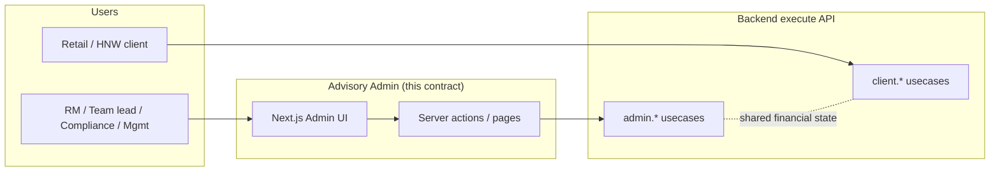
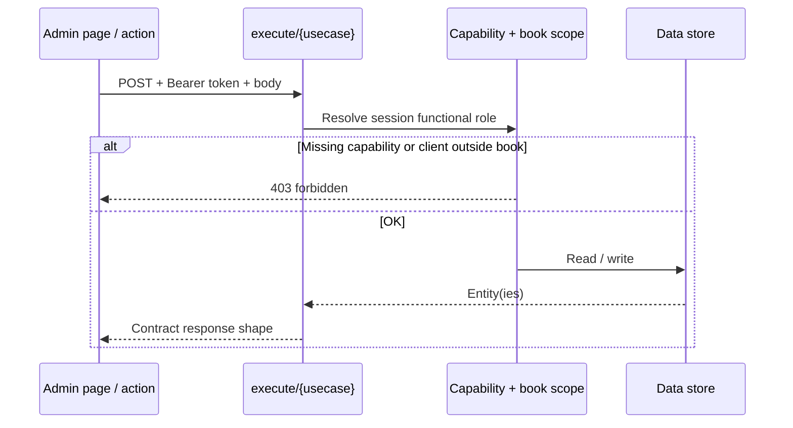
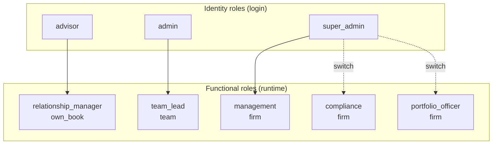
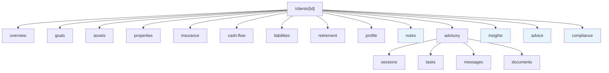
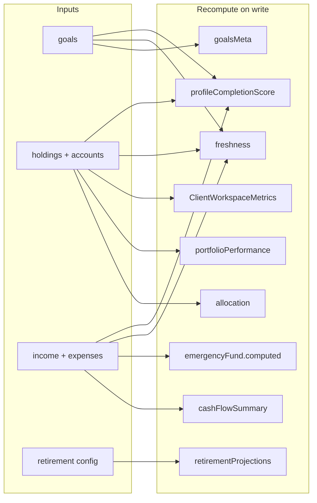
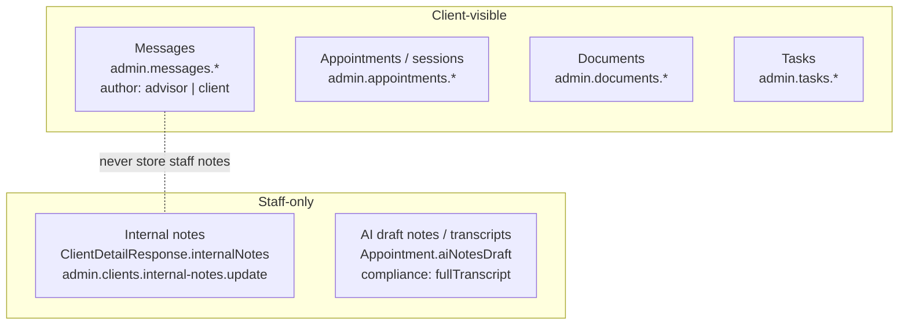
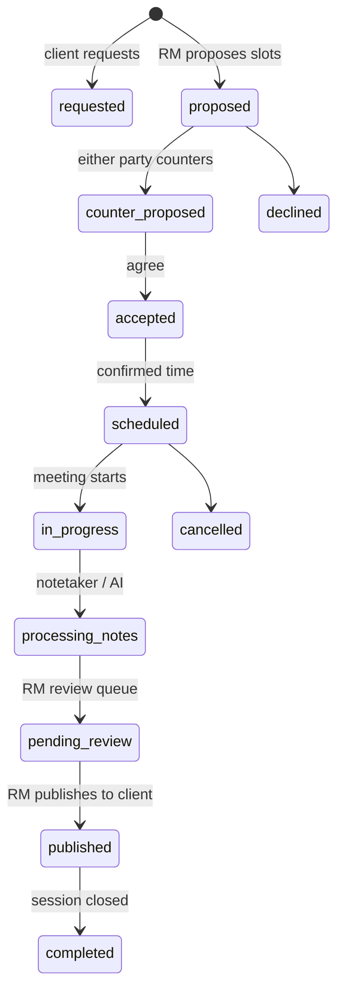
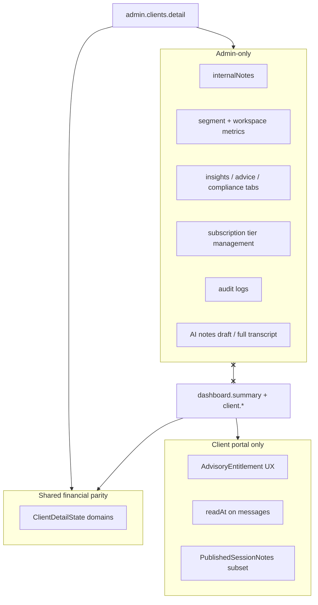

# Celerey Advisory Admin — Architecture Guide

**Contract version:** `1.2.1`  
**Canonical spec:** [`celerey-advisory-admin-contract.json`](./celerey-advisory-admin-contract.json)  
**Client portal spec:** [`celerey-client-advisory-contract.json`](./celerey-client-advisory-contract.json)  
**Field inventory (persona):** [`../docs/full-client-by-tab.json`](../docs/full-client-by-tab.json)

This document is the **at-a-glance map** for engineers and agents implementing the admin backend. If anything here disagrees with the JSON contract, **the contract wins**. Update this guide when the contract version bumps.

---

## 1. What this system is

The **Advisory Admin** is the staff-facing portal for relationship managers, team leads, compliance, and management. It sits beside the **Client Advisory Portal** (end-user app). Both share financial profile data; the admin app adds book management, oversight, compliance, and staff-only fields.



**Out of scope for this contract** (see `info.outOfScope`): Copilot streaming, DeepSeek narrative, client portal UI build.

---

## 2. How to call the API

| Item | Value |
|------|--------|
| Base URL | `https://api-uat.celerey.app/api/execute` |
| Request | `POST {baseUrl}/{usecase}` |
| Auth | `Authorization: Bearer <session_token>` |
| Multipart | `admin.documents.upload`, `admin.settings.profile.avatar.upload` |

Every usecase in the contract declares: `method`, `capability`, `bookScope` enforcement, `body`/`query`, `response`, and `pageMapping` (which admin UI route consumes it).



---

## 3. Identity vs functional roles

Staff log in with an **identity role** (`advisor`, `admin`, `super_admin`). The app runs as a **functional role** that defines menus, capabilities, and book scope.



### Book scope (data visibility)

| Scope | Who | Sees clients |
|-------|-----|----------------|
| `own_book` | Relationship Manager | Assigned clients only |
| `team` | Team Lead | Own + direct reports' books |
| `firm` | Compliance, Management, Portfolio Officer | All clients |

**Backend must enforce scope on every `admin.clients.*` read/write**, not only the UI.

### RM visibility (UI convention — not a separate API)

`Client.advisorId` / `Client.advisorName` are **always** on list and detail. The admin UI shows an **RM badge/column** only when `bookScope` is `team` or `firm` (`uiConventions.clientListAssignedAdvisor`). RMs on `own_book` do not need a tag — the client is theirs.

---

## 4. Capabilities gate the UI and API

Branch on **capabilities**, never on raw identity role. Key gates for client work:

| Capability | Meaning |
|------------|---------|
| `view_client_360` | Full workspace: financial tabs + Notes, Insights, Advice, Compliance |
| `view_client_portfolio` | Financial tabs only (no Notes / compliance / advice) |
| `edit_client_data` | CRUD profile entities + append internal notes |
| `assign_advisor` | Reassign RM (`admin.clients.assign-advisor`) |
| `message_client` | Threads and send (`admin.messages.*`) |
| `manage_documents` | Upload/delete documents |
| `generate_report` | PDF reports |
| `approve_recommendation` | Compliance / team lead sign-off |
| `manage_compliance` | Compliance tab records |

Portfolio Officer has **`view_client_portfolio` only** — no 360, no messaging, no profile edits.

---

## 5. Core data model

### 5.1 List vs detail

```mermaid
erDiagram
  Client ||--o{ ClientInternalNote : "detail only"
  ClientDetailResponse ||--|| Client : summary
  ClientDetailResponse ||--|{ ClientInternalNote : internalNotes
  ClientDetailResponse ||--|| ClientDetailState : state
  ClientDetailResponse ||--o| ClientWorkspaceMetrics : metrics
  ClientDetailResponse }o--|| ClientSegment : segment

  Client {
    uuid id
    string firstName lastName email phone
    enum status riskLevel subscription
    number aua aum
    uuid advisorId
    string advisorName location
    datetime lastContactAt nextReviewAt joinedAt
  }

  ClientInternalNote {
    uuid id
    string body
    uuid authorId
    string authorName
    datetime createdAt
  }

  ClientDetailState {
    ClientDetailUser user
    Goal goals
    Holding holdings
    Account accounts
    PropertyAsset propertyAssets
    Liability liabilities
    InsurancePolicy insurancePolicies
    RetirementProfile retirement
    EmergencyFund emergencyFund
  }
```

| Surface | Endpoint | Shape |
|---------|----------|--------|
| Client list / search | `admin.clients.find` | `Client[]` in paginated response |
| Client workspace | `admin.clients.detail` | **`ClientDetailResponse`** |
| Client portal home | `dashboard.summary` (client contract) | Flat financial store — **no admin fields** |

### 5.2 `ClientDetailResponse` (v1.2.1)

```text
{
  id,
  subscription,          // celerey_core | free_trial | not_onboarded
  segment,                 // uhnw | hnw | affluent | emerging
  summary: Client,         // NO internalNotes here
  internalNotes: ClientInternalNote[],  // append-only, newest first
  state: ClientDetailState,
  metrics: ClientWorkspaceMetrics       // header KPIs, insights
}
```

### 5.3 AUA vs AUM

- **AUA** — total assets under advice (includes managed + held-away / advice-only).
- **AUM** — managed subset; always `AUM <= AUA`.
- Relationship labels in UI are **stats text**, not badge stacks (`uiConventions.clientHeaderMeta`).

---

## 6. Client workspace — tabs and routing

Admin URL pattern: `/clients/[id]?tab={slug}`  
Advisory sub-tabs: `/clients/[id]?tab=advisory&advisory={sessions|tasks|messages|documents}`



| Tab slug | Client portal tab | Primary `state` keys | Write usecases |
|----------|-------------------|----------------------|----------------|
| `overview` | `tabs.overview` | Aggregates + alerts | — |
| `goals` | `tabs.goals` | `goals`, `goalsMeta` | `admin.clients.goals.*` |
| `assets` | `tabs.assets` | `holdings`, `accounts`, `allocation`, `portfolioPerformance` | `admin.clients.holdings.*`, `accounts.*` |
| `properties` | `tabs.properties` | `propertyAssets` (+ nested mortgage/insurance) | `admin.clients.property.*` |
| `insurance` | `tabs.insurance` | `insurancePolicies` | `admin.clients.insurance.*` |
| `cash-flow` | `tabs.cash_flow` | `incomeRows`, `expenseCategories`, `emergencyFund`, `cashFlowHistory`, `cashFlowSummary` | `income.*`, `expenses.*`, `emergency-fund.update` |
| `liabilities` | `tabs.liabilities` | `liabilities` (standalone, not property mortgages) | `admin.clients.liabilities.*` |
| `retirement` | `tabs.retirement` | `retirement`, `retirementProjections` | `admin.clients.retirement.update` |
| `profile` | `tabs.account_profile` | `user`, `dependents`, `riskAssessment`, `taxProfile` | `user.update`, `risk-assessment.submit`, `dependents.*`, `tax-profile.update` |
| `notes` | **admin only** | `internalNotes` | `admin.clients.internal-notes.update` |
| `advisory` | `tabs.advisor` | Appointments, tasks, threads, documents (separate finds) | See §8 |
| `insights` | **admin only** | `admin.clients.intelligence.get`, suitability | — |
| `advice` | **admin only** | Recommendations, products | `admin.recommendations.*` |
| `compliance` | **admin only** | Compliance records, audit | `admin.compliance.*` |

Reference persona field checklist: `docs/full-client-by-tab.json`.

---

## 7. Derived fields — recompute after writes

These live on `ClientDetailState` or `metrics` and **must be recomputed** when underlying entities change (do not treat as user-editable source of truth):



| Derived field | Triggered by |
|---------------|--------------|
| `goalsMeta` | Goal create/update/delete |
| `cashFlowSummary` | Income/expense changes |
| `emergencyFund.computed` | Expenses or cash balance changes |
| `retirementProjections` | Retirement profile update |
| `allocation`, `portfolioPerformance` | Holdings/accounts changes |
| `freshness[]` | Any section write (per-section `updatedAt`) |
| `profileCompletionScore` | Profile/financial completeness |
| `summary.aua`, `summary.aum` | Holdings, accounts, relationship rules |

Return the updated **`ClientDetailResponse`** (or at minimum refreshed derived slices) after profile CRUD.

---

## 8. Advisory domain — three separate concerns

Do **not** merge these into one blob:



### 8.1 Internal notes (v1.2.1)

- **Storage:** `ClientDetailResponse.internalNotes[]` — **not** on `Client` summary, **not** in message threads.
- **Write:** `admin.clients.internal-notes.update` — **append only** (`data.body`).
- **Entry shape:** `{ id, body, authorId, authorName, createdAt }`.
- **Read:** Full log on `?tab=notes`; latest preview on `?tab=overview` when `view_client_360`.
- **Client portal:** Must never appear on `dashboard.summary` or any `client.*` endpoint.

### 8.2 Messages

- One thread per client–advisor pair.
- `admin.messages.messages.send` — **`author: advisor`** only (client-visible).
- Legacy `author=note` is **removed**; use internal notes API instead.

### 8.3 Appointments lifecycle (simplified)



**Contact tracking:** `lastContactAt` updates on **client/advisor messages** and **logged sessions** (`admin.appointments.log`) — not on internal notes or profile edits alone. See `entities.ContactTrackingRules`.

**Admin ↔ client status mapping:** Admin may expose `scheduled`/`accepted`; client portal maps these to `upcoming`. See `frontendChanges.schemaMapping.Appointment.statusMapping`.

---

## 9. Admin vs client portal boundary



| Rule | Detail |
|------|--------|
| Financial `state` | Should mirror client portal domains; admin may use camelCase, normalizers accept snake_case aliases |
| `internalNotes` | Admin detail only; append-only |
| `subscription` | Admin tracks `not_onboarded \| free_trial \| celerey_core` — not a full client entitlements mirror |
| Session notes | Client sees **published** subset only; admin has draft + full transcript for compliance |

Cross-reference: `frontendChanges.adminToClientUsecasePairs` in the contract.

---

## 10. Domain → responsibility map

High-level grouping of the **121 usecases** (see contract `domains` + `usecases` arrays):

| Domain | Responsibility | Example usecases |
|--------|----------------|------------------|
| `auth` | Session, role switch, permissions | `admin.auth.me`, `admin.session.switch-role` |
| `dashboard` | Firm overview, book metrics | `admin.dashboard.summary`, `admin.dashboard.book-metrics` |
| `clients` | List, detail, create, assign, subscription, intelligence | `admin.clients.find`, `admin.clients.detail`, `admin.clients.create` |
| `clientProfile` | CRUD financial/profile entities | `admin.clients.goals.*`, `holdings.*`, `retirement.update`, … |
| `messages` | Threads | `admin.messages.threads.*`, `admin.messages.messages.send` |
| `appointments` | Schedule, confirm, log, publish notes | `admin.appointments.*` |
| `tasks` | Open/done tasks | `admin.tasks.*` |
| `documents` | Upload/list/delete | `admin.documents.*` |
| `recommendations` | Advice workflow | `admin.recommendations.*` |
| `reports` | PDF generation | `admin.reports.*` |
| `compliance` | Suitability queue, records | `admin.compliance.*` |
| `insights` | Firm analytics | `admin.insights.*` |
| `integrations` | Calendar, notetaker OAuth | `admin.integrations.*` |
| `settings` | Staff profile, audit | `admin.settings.*` |

---

## 11. Common flows (implementation checklist)

### 11.1 Open client workspace

1. `admin.clients.detail?client_id=` → `ClientDetailResponse`
2. Enforce `view_client_360` **or** `view_client_portfolio` + hide admin-only tabs in UI
3. Enforce book scope on `client_id`
4. Tab content reads from `state.*` or domain-specific finds (advisory)

### 11.2 RM edits a goal

1. `admin.clients.goals.update` with typed body (contract)
2. Recompute `goalsMeta`, `freshness`, `profileCompletionScore`, possibly `summary.goalsCount`
3. Optionally return fresh detail or let client re-fetch `admin.clients.detail`

### 11.3 Staff adds internal note

1. `admin.clients.internal-notes.update` `{ client_id, data: { body } }`
2. Append `ClientInternalNote` with session `authorId` / `authorName`
3. Response includes `{ updated, clientId, note }`
4. **Do not** create a message thread entry

### 11.4 Create client (direct)

1. `admin.clients.create` with `creationMode: direct` + `identity` payload
2. Initialize empty `internalNotes: []`, default `state` shells, assign `advisor_id`
3. Subscription: `not_onboarded` unless `grantCore` → `celerey_core`

### 11.5 Publish session notes to client

1. RM reviews `aiNotesDraft` → `admin.appointments.publish-notes`
2. Client portal receives `PublishedSessionNotes` subset (no `fullTranscript`)
3. May update `lastContactAt` when session is **logged**, not merely published

---

## 12. Agent guardrails — do NOT

When implementing or extending the backend, **avoid these common mistakes**:

| ❌ Don't | ✅ Do instead |
|----------|----------------|
| Put `internalNotes` on `Client` summary or message threads | Use `ClientDetailResponse.internalNotes` + append endpoint |
| Replace entire note log on update | Append one `ClientInternalNote` per call |
| Expose `internalNotes` on `client.*` or `dashboard.summary` | Admin detail + staff capabilities only |
| Use `author=note` on messages | Internal notes API |
| Branch authorization on identity role (`admin`, `advisor`) | Use functional role **capabilities** + **bookScope** |
| Return profile writes without recomputing derived fields | Recompute §7 list |
| Invent new workspace tab slugs (`plan`, `portfolio`, `comms`, `service`) | Use contract `clientPortalFinancialParity.adminTabSlugs` |
| Store client entitlements mirror on admin subscription field | Admin subscription = onboarding tier only |
| Skip book scope on `admin.clients.find` | Filter by `own_book` / `team` / `firm` |
| Add financial fields only to admin without client parity path | Update both contracts + `full-client-by-tab.json` |

---

## 13. Version alignment checklist

When the backend agent finishes work, verify:

- [ ] Contract `info.version` matches this guide header
- [ ] `admin.clients.detail` returns **`ClientDetailResponse`** (not flat `{ summary, state }` without `internalNotes` / `segment` / `metrics`)
- [ ] `Client` entity has **no** `internalNotes` field
- [ ] Internal notes endpoint is **append-only** with `data.body`
- [ ] Workspace tab slugs match `clientPortalFinancialParity.adminTabSlugs`
- [ ] Advisory routes use `?tab=advisory&advisory=…`
- [ ] Derived fields recomputed after profile CRUD
- [ ] Client portal exclusions honored for `internalNotes`

---

## 14. Related documents

| Document | Purpose |
|----------|---------|
| [`celerey-advisory-admin-contract.json`](./celerey-advisory-admin-contract.json) | Full usecase + entity spec (source of truth) |
| [`celerey-client-advisory-contract.json`](./celerey-client-advisory-contract.json) | Client portal API + `client.*` namespace |
| [`../docs/full-client-by-tab.json`](../docs/full-client-by-tab.json) | Reference persona (Ada Mensah) field inventory by tab |
| [`../docs/admin-client-parity-gaps.md`](../docs/admin-client-parity-gaps.md) | Shorter parity checklist (update to v1.2.1 when syncing) |
| `clientPortalFinancialParity` section in contract | Tab mapping, derived fields, exclusions |
| `uiConventions` section in contract | RM visibility, header meta, notes placement |
| `frontendChanges` section in contract | Admin ↔ client schema aliases and usecase pairs |

---

*Last synced with contract **v1.2.1** (2026-09-11).*
